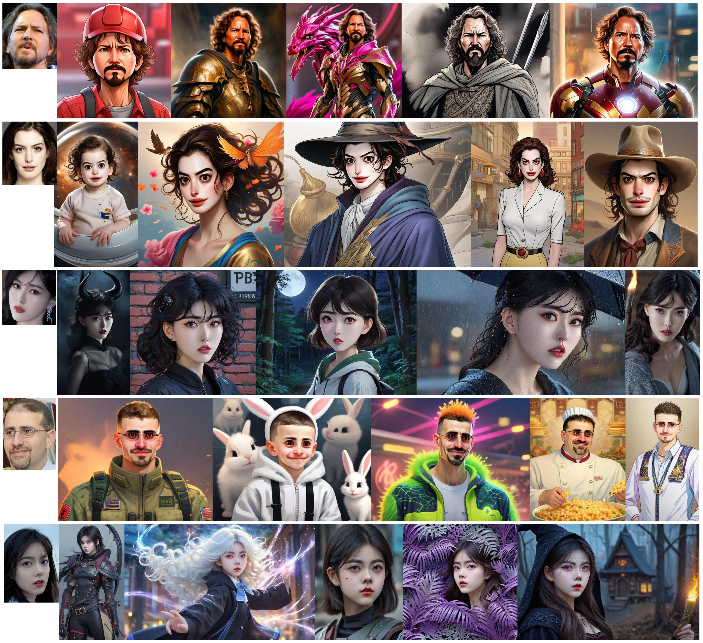

<div align="center">

<h1> ID-Aligner: Enhancing Identity-Preserving Text-to-Image Generation with Reward Feedback Learning  </h1>

Weifeng Chen*, Jiacheng Zhang*, Jie Wu†, Hefeng Wu, Xuefeng Xiao, Liang Lin

(*Equal Contribution , † Project Lead)

ByteDance, Sun Yat-Sen University


<a href='https://idaligner.github.io/'></a> 
<a href='https://arxiv.org/abs/2403.02084'></a> 

<!-- [](https://huggingface.co/spaces/jiaxiangc/res-adapter) -->
<!-- [](https://github.com/jiaxiangc/ComfyUI-ResAdapter) -->
<!--   -->

<!-- 

Comparison examples between resadapter and [dreamlike-diffusion-1.0](https://civitai.com/models/1274/dreamlike-diffusion-10). -->

</div>



<!--  -->

## Release

- `[2024/04/24]` 🔥 We release the [arxiv paper](https://arxiv.org/).


<!-- ## Quicktour

We provide a standalone [example code](quicktour.py) to help you quickly use resadapter with diffusion models.

<div align=center> -->

<!-- </div> -->


<!-- ## Star History
[](https://star-history.com/#Weifeng-Chen/ID-Aligner&Date) -->

## Citation
If you find ID-Aligner useful for your research and applications, please cite us using this BibTeX:
```

```
For any question, please feel free to contact us.